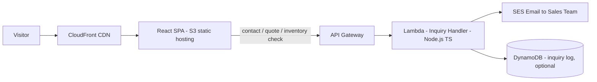

# Kinstone Website — Design Overview

## Company Context

Kinstone is a steel structure company transitioning from a traditional Chinese steel manufacturer into an international steel manufacturing and trading company. The long-term vision may include a platform for steel trading, but **this stage is information-only** — the website's job is to present the company, its products, and its portfolio to international buyers.

## Stage Scope

| In scope | Out of scope |
|---|---|
| Company information pages (Home, Products, Portfolio, About, Contact) | Order / transaction flows |
| Bilingual content (English + Chinese) | User accounts / authentication |
| Contact form for general questions, quote requests, inventory checks | Product catalog management / CMS |
| Static product & portfolio data bundled with the frontend | Admin dashboard |
| Single serverless inquiry endpoint (design only) | Database for content |

**Primary conversion path:** visitors browse the site and use **Contact Us** to ask questions, request quotes, or check inventory. The sales team follows up manually.

## Architecture



### Key decisions

- **Frontend:** React + Vite + TypeScript, Tailwind CSS, bilingual EN/ZH.
- **Content:** Static JSON files bundled with the frontend build — no content API.
- **Backend (future):** Single Node.js/TypeScript Lambda behind API Gateway for inquiry submissions only.
- **Infra:** AWS serverless stack — S3, CloudFront, API Gateway, Lambda, SES, optional DynamoDB.

## Design Doc Index

| Doc | Description |
|---|---|
| [01-backend-architecture.md](./01-backend-architecture.md) | Inquiry service design, data model, validation |
| [02-api-registry.md](./02-api-registry.md) | API endpoint reference |
| [02-openapi.yaml](./02-openapi.yaml) | OpenAPI 3.0 spec stub |
| [03-ui-design.md](./03-ui-design.md) | Visual direction, page wireframes, components |
| [04-infra-design.md](./04-infra-design.md) | AWS infrastructure, CI/CD, security |

## Repo Layout

```
kinstone-website/
  docs/design/          ← you are here
  frontend/             ← React + Vite app
  README.md
```
