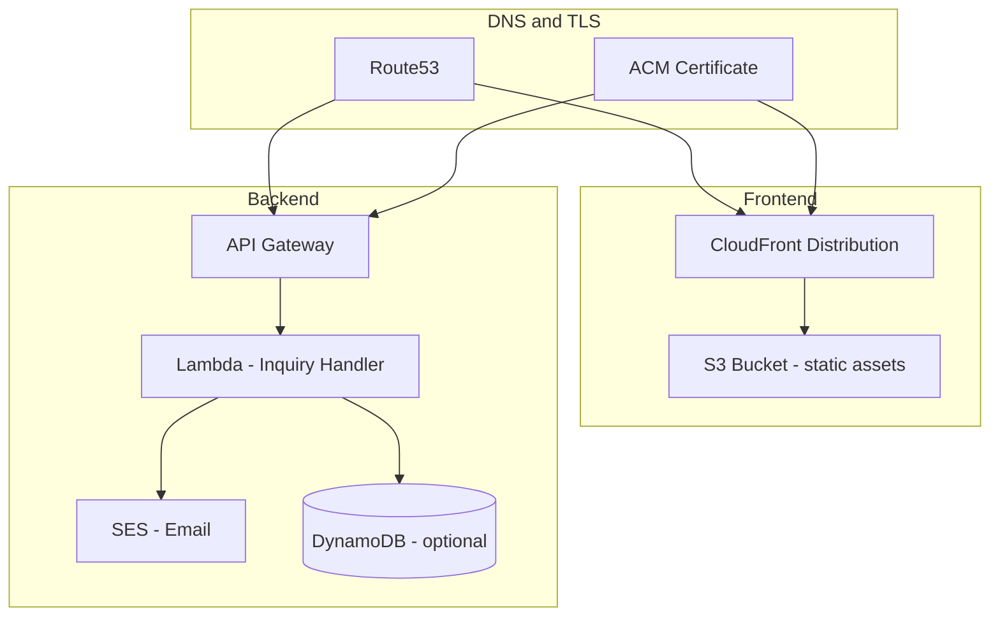

# Infrastructure Design

## Overview

The infrastructure is intentionally minimal — a static frontend on S3/CloudFront and a single serverless function for inquiry submissions. No VPC, RDS, or ECS at this stage.

## Architecture



## AWS Resources

| Resource | Purpose | Notes |
|---|---|---|
| **S3 Bucket** | Host built frontend (HTML/JS/CSS) | Private bucket, accessed only via CloudFront OAC |
| **CloudFront** | CDN for frontend + TLS termination | Custom domain, ACM cert, cache static assets |
| **Route53** | DNS for `kinstone.com` and `api.kinstone.com` | A/AAAA alias records |
| **ACM** | TLS certificates | Auto-renewed, us-east-1 for CloudFront |
| **API Gateway** | HTTP API for `/api/inquiries` and `/api/health` | Rate limiting, CORS for frontend origin |
| **Lambda** | Inquiry handler (Node.js 20 / TypeScript) | 128 MB, 10s timeout |
| **SES** | Send inquiry notification emails | Verified sender domain |
| **DynamoDB** | Optional inquiry log table | On-demand capacity, single table |
| **CloudWatch** | Logs and basic alarms | Lambda errors, API 5xx rate |
| **Secrets Manager** | Store SES/API config if needed | Minimal secrets at this stage |

### What is NOT needed

- VPC / subnets / NAT gateway
- RDS / Postgres
- ECS / Fargate / ECR
- ElastiCache / Redis
- WAF (can add later if traffic warrants it)

## Environments

| Environment | Frontend URL | API URL | Purpose |
|---|---|---|---|
| **dev** | `dev.kinstone.com` | `api-dev.kinstone.com` | Development and testing |
| **prod** | `kinstone.com` / `www.kinstone.com` | `api.kinstone.com` | Production |

Two environments are sufficient for this stage. A staging environment can be added later if needed.

## CI/CD (GitHub Actions)

### Frontend Pipeline

```
Trigger: push to main (frontend/ changes)
  1. npm ci && npm run build
  2. aws s3 sync dist/ s3://kinstone-frontend-prod --delete
  3. aws cloudfront create-invalidation --distribution-id XXX --paths "/*"
```

### Backend Pipeline

```
Trigger: push to main (backend/ changes, future)
  1. npm ci && npm run build
  2. cd infra && npx cdk deploy --require-approval never
```

Both pipelines use GitHub OIDC for AWS authentication (no long-lived access keys).

## Infrastructure as Code

**Recommendation:** AWS CDK in TypeScript, co-located in an `infra/` directory at the repo root (future implementation).

```
infra/
  bin/app.ts
  lib/
    frontend-stack.ts    # S3 + CloudFront + Route53
    api-stack.ts         # API Gateway + Lambda + SES + DynamoDB
  cdk.json
  package.json
```

## Security

| Area | Approach |
|---|---|
| S3 bucket | Private; CloudFront Origin Access Control (OAC) |
| API Gateway | CORS restricted to frontend origin; rate limiting (10 req/min/IP) |
| Lambda | Least-privilege IAM role (SES send, DynamoDB write only) |
| TLS | ACM certificates, HTTPS enforced on CloudFront and API Gateway |
| Secrets | Environment variables via Lambda config; Secrets Manager if keys are needed |
| Spam | Honeypot field + API Gateway throttling |

## Observability

| Signal | Tool | Alert |
|---|---|---|
| Lambda errors | CloudWatch Logs + Metric Filter | > 5 errors in 5 min |
| API 5xx rate | API Gateway metrics | > 1% over 5 min |
| SES bounces | SES event notifications (SNS) | Any bounce |
| Frontend uptime | CloudFront monitoring (optional) | 5xx from origin |

## Cost Estimate (monthly, low traffic)

| Resource | Estimated Cost |
|---|---|
| S3 + CloudFront | ~$1–5 |
| API Gateway + Lambda | ~$0 (free tier) |
| DynamoDB (on-demand) | ~$0 (free tier) |
| SES | ~$0 (free tier, 62k emails/month) |
| Route53 | ~$0.50/zone |
| **Total** | **~$2–6/month** |

## Future Scaling Path (brief)

If order/transaction flows are introduced later:

1. **Content management** — add a headless CMS or admin API; may need RDS.
2. **User accounts** — add Cognito or custom auth; introduce a proper backend service (ECS or Lambda functions per domain).
3. **Order processing** — separate service with RDS Postgres, potentially SQS for async processing.
4. **WAF** — add AWS WAF on CloudFront if traffic or abuse increases.

These are explicitly out of scope for the current stage and should not influence today's infrastructure decisions.
